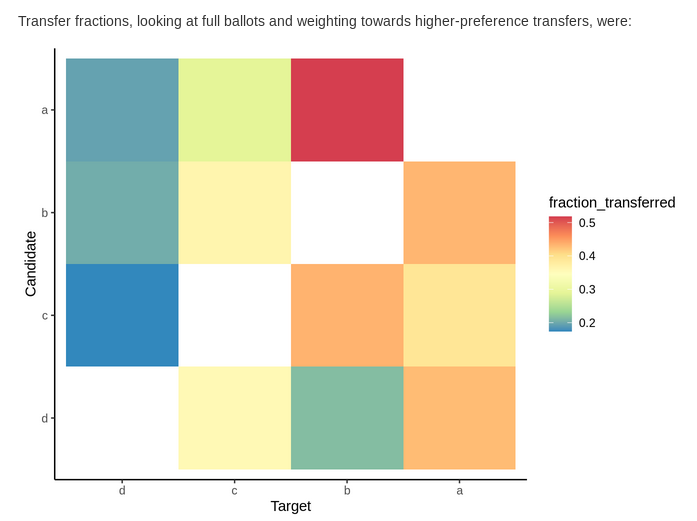
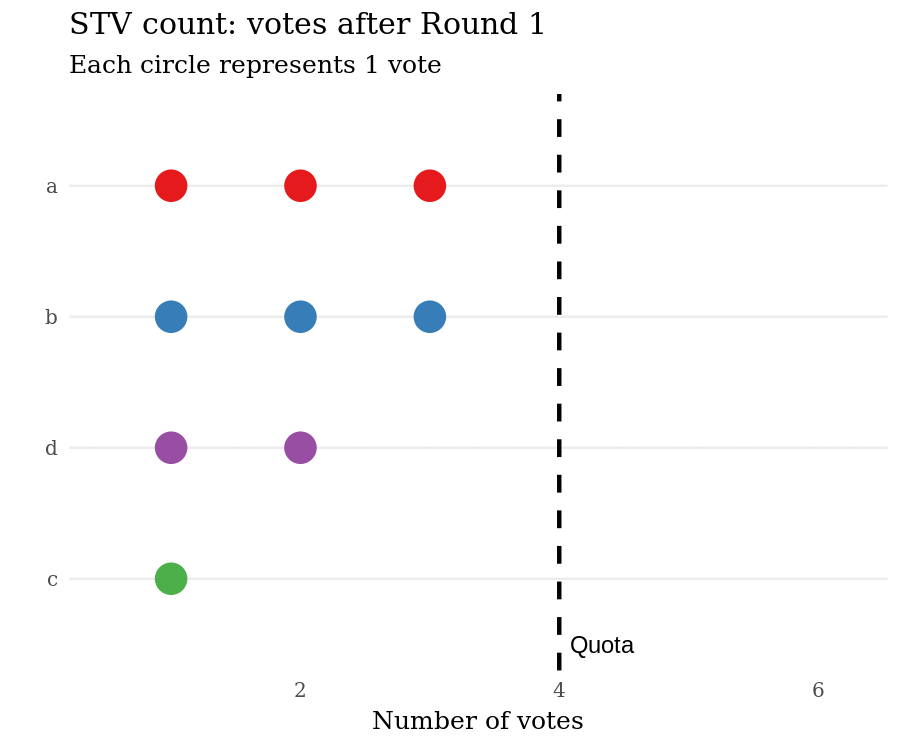

# avr
Alternative voting systems in R.

Currently supports [instant runoff voting](https://en.wikipedia.org/wiki/Instant-runoff_voting), [single transferable vote](https://en.wikipedia.org/wiki/Single_transferable_vote) (STV), [Borda](https://en.wikipedia.org/wiki/Borda_count), and [Schulze/Condorcet](https://en.wikipedia.org/wiki/Condorcet_method) methods.

### Input 

Votes can be provided as a vector of lists of preferences, in numbered ballot card format, or read from csv:

```r
votes <- list(
  n1 = c("a", "b", "c", "d"),
  n2 = c("a", "b", "c", "d"),
  n3 = c("a", "b", "d", "c"),
  n4 = c("b", "a", "c", "d"),
  n5 = c("b", "a", "c", "d"),
  n6 = c("c", "b", "a", "d"),
  n7 = c("c", "b", "a", "d"),
  n8 = c("d", "c", "a", "b"),
  n9 = c("d", "a", "b", "c")
)

map <- c("a", "b", "c", "d")
votes <- list(
  ballot(1, 2, 3, 4, map = map),
  ballot(1, 2, 3, 4, map = map),
  ballot(1, 2, 4, 3, map = map),
  ballot(2, 1, 3, 4, map = map),
  ballot(2, 1, 3, 4, map = map),
  ballot(3, 2, 1, 4, map = map),
  ballot(3, 2, 1, 4, map = map),
  ballot(3, 4, 2, 1, map = map),
  ballot(2, 3, 4, 1, map = map)
)

# my_votes_table.csv:
# a,1,1,1,2,2,3,3,3,2
# b,2,2,2,1,1,2,2,4,3
# c,3,3,4,3,3,1,1,2,4
# d,4,4,3,4,4,4,4,1,1
votes <- read_votes_from_csv('my_votes_table.csv')

# my_votes_table.csv:
# a,b,c,d
# 1,2,3,4
# 1,2,3,4
# 1,2,4,3
# 2,1,3,4
# 2,1,3,4
# 3,2,1,4
# 3,2,1,4
# 3,4,2,1
# 2,3,4,1
votes <- read_votes_from_csv('my_votes_table_alt.csv', ballots_as_rows = FALSE)
```

### Methods 

STV can be run as a single iteration, or, because elections with small numbers of votes often involve ties, in ensemble mode, with ties resolved randomly:

```r
stv(votes, 2)  #random resolution of ties, e.g.
# An avr stv object.
# Winners:
# Round 1:        a
# Round 2:        c

ensemble_stv(votes, 2, nensemble = 10)
# 3 possible pathways
# Winners:
#   candidate elected_pct
# 1         a         100
# 2         c          62
# 3         b          38
```

Different voting systems can produce different results:

```r
schulze(votes, 2)   #deterministically gives a,b as winners
# An avr Schulze object.
# Winners:
# a
# b
```

### Output

Use `report = TRUE` to generate an HTML report showing the round-by-round election results and the vote transfers that occurred.

```r
stv(votes, 2, report = TRUE, report_path = './abcd_vote_report.html')
```
Sample:


Sample:



And for STV, an animation of the count can be generated from the count result table:

```r
count_result <- stv(votes, 2, getTable = TRUE)
create_stv_count_gif(count_result, 'abcd_vote_count.gif')
```


